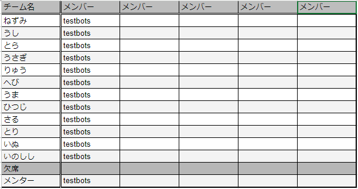

# hackathon-util

ハッカソンを開催するときにDiscordのロールとチャンネル生成を自動でやるやつ

[サンプルのスプレッドシート](https://docs.google.com/spreadsheets/d/1kOFmbrdYd4gsF3i0bo5PuteUYWqq5R-g0i65jdRZMy0/edit?usp=sharing)



### 注意点
1. 欠席というチーム名を付けた場合無視されます。
2. メンバーは1チーム1行にしてください。
3. ユーザ名はdiscordの @から始まるIDを @ なしで入力してください。


## 使い方

### 環境変数を設定
```bash
# .env.example からコピー
cp .env.example .env
```

### .env の設定
```env
# Application Env
ENV=                                                                   # 開発環境: dev, 本番環境: prod 特に指定しない場合は prod
# Google Env
GOOGLE_SPREADSHEET_ID=1kOFmbrdYd4gsF3i0bo5PuteUYWqq5R-g0i65jdRZMy0　   # まとめてる対象のスプレッドシートID
GOOGLE_SPREADSHEET_RANGE=チームシート!A2:F15　                          # 対象の範囲
# Discord Env
DISCORD_BOT_TOKEN=                                                     # DiscordのBotのトークン
DISCORD_GUILD_ID=                                                      # 対象のDiscordサーバー
```

### credential ファイルの生成

1. Google Cloudから [スプレッドシートAPI](https://console.cloud.google.com/apis/library/sheets.googleapis.com?hl=ja)を有効にする 
2. スプレッドシートAPIの管理から認証情報 -> 認証情報の作成 -> サービスアカウントを選択
3. 適切な権限のSAを作ったら保存
4. サービス アカウントから保存されたSAを選択 -> キー -> 鍵を追加 -> 新しい鍵 -> json を選択
5. 生成されたjsonを落として、hackathon-utilの直下に"credential.json"として保存 

### 実行方法

```bash
# ロールを作る
make create_role
# ロールを削除する
make delete_role
# チャンネルを作る
make create_channel
# チャンネルを削除する
make delete_channel
# ロールをバインドする
make bind_role
# 同期する (delete role -> create role -> bind role)の順に実行するだけ
make sync_role
```