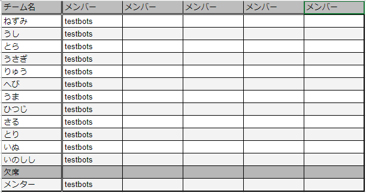

# hackathon-util

ハッカソンでDiscordのロール・チャンネル・カテゴリを自動管理するツール集

[サンプルのスプレッドシート](https://docs.google.com/spreadsheets/d/1kOFmbrdYd4gsF3i0bo5PuteUYWqq5R-g0i65jdRZMy0/edit?usp=sharing)



## 提供ツール

### cmd/hackathon-util（推奨）

YAMLマニフェストとサブコマンドで操作する新しいCLI。`create` と `delete` の2つのサブコマンドを持つ。

**機能:**
- `create` サブコマンド
  - 全参加者用の共通ロール `@参加者_{EVENT_NAME}` の作成・付与
  - メンター用ロール `@メンター_{EVENT_NAME}` の作成（色: #3498db）
  - チームごとのロール作成
  - チームごとのカテゴリ作成（テキストチャンネル「やりとり」とボイスチャンネル「会話」を含む）
    - カテゴリ・チャンネルがすでに存在する場合は権限のみ更新
    - `enablePrivateVC: true` でボイスチャンネル「会話」を参加者ロール・メンターロール保持者のみに表示
    - `enablePrivateCategory: true` でカテゴリ全体をチームロール・メンターロール保持者のみに表示
    - `muteRoleID` を設定すると、そのロールに対してメッセージ送信・リアクション・VC接続などを禁止
  - スプレッドシートの各行 B〜F列のユーザー名（最大5名）にチームロールと参加者ロールを付与
  - Discord上に存在しないユーザーの一覧を実行後に表示
- `delete` サブコマンド
  - スプレッドシートに記載されたチームのカテゴリ・配下チャンネルを削除
  - チームロールをメンバーから剥奪し、ロール自体を削除
  - `--remove-all-members` で全参加者ロール `@参加者_{EVENT_NAME}` からメンバーを剥奪（ロール自体は削除しない）
  - `--dry-run`（デフォルト: `true`）で実際の削除を行わず対象を確認できる

**YAMLマニフェストによる権限設定:**

| `enablePrivateCategory` | `enablePrivateVC` | `#やりとり`                   | `#会話`                       |
| ----------------------- | ----------------- | ----------------------------- | ----------------------------- |
| `false`                 | `false`           | `@everyone`                   | `@everyone`                   |
| `false`                 | `true`            | `@everyone`                   | 参加者ロール + メンターロール |
| `true`                  | true/false        | チームロール + メンターロール | チームロール + メンターロール |

※ `enablePrivateCategory: true` の場合、`enablePrivateVC` の設定は上書きされます

**実行方法:**

```bash
# チャンネル・ロールを作成
go run cmd/hackathon-util/main.go -f example.yaml create

# ドライラン（デフォルト）: 削除対象を確認するだけで実際には削除しない
go run cmd/hackathon-util/main.go -f example.yaml delete

# 実際に削除
go run cmd/hackathon-util/main.go -f example.yaml delete --dry-run=false

# 参加者ロールからもメンバーを剥奪する場合
go run cmd/hackathon-util/main.go -f example.yaml delete --dry-run=false --remove-all-members
```

---

### cmd/sheet-to-discord（旧実装）

> **非推奨:** 新しい `cmd/hackathon-util` の使用を推奨します。

Googleスプレッドシートからチーム情報を読み取り、Discordにロール・カテゴリ・チャンネルを自動生成するスクリプト

**実行方法:**

```bash
# 通常実行
go run cmd/sheet-to-discord/main.go

# ボイスチャンネル「会話」のみをプライベートにする
PRIVATE_VC=true go run cmd/sheet-to-discord/main.go

# カテゴリをプライベートにする
PRIVATE_CATEGORY=true go run cmd/sheet-to-discord/main.go
```

---

### cmd/sheet-to-discord-delete（旧実装）

> **非推奨:** 新しい `cmd/hackathon-util` の使用を推奨します。

ハッカソン終了後のクリーンアップ用スクリプト

**実行方法:**

```bash
# ドライラン（デフォルト）: 削除対象を確認するだけで実際には削除しない
go run cmd/sheet-to-discord-delete/main.go

# 実際に削除
DRY_RUN=false go run cmd/sheet-to-discord-delete/main.go

# 参加者ロールからもメンバーを剥奪する場合
DRY_RUN=false REMOVE_ALL_MEMBERS=true go run cmd/sheet-to-discord-delete/main.go
```

---

## セットアップ

### YAMLマニフェストを作成

`example.yaml` をコピーして編集する。

```bash
cp example.yaml config.yaml
```

```yaml
eventName: "hoge"
googleSheet:
  id: "hoge"
  teamTableRange: "hoge!A:Z"
  credentialFile: "./credential.json"
discord:
  guildID: "hoge"
  muteRoleID: "hoge"       # 省略可
  enablePrivateVC: false
  enablePrivateCategory: false
```

### 環境変数を設定

```bash
cp .env.example .env
```

### 環境変数一覧

| 変数名 | 必須 | 説明 |
|---|---|---|
| `DISCORD_BOT_TOKEN` | ✅ | DiscordのBotトークン |
| `GOOGLE_SPREADSHEET_ID` | ※旧実装のみ | 対象のスプレッドシートID |
| `TEAM_RANGE` | ※旧実装のみ | チーム情報の範囲（例: `チームシート!A2:F15`） |
| `GOOGLE_CREDENTIALS_FILE` | ※旧実装のみ | Google認証情報ファイルのパス |
| `EVENT_NAME` | ※旧実装のみ | イベント名。参加者・メンターロール名のサフィックスに使用 |
| `DISCORD_GUILD_ID` | ※旧実装のみ | 対象のDiscordサーバーID |
| `PRIVATE_VC` | ※旧実装のみ | `true` でボイスチャンネルをプライベートにする（デフォルト: `false`） |
| `PRIVATE_CATEGORY` | ※旧実装のみ | `true` でカテゴリをプライベートにする（デフォルト: `false`） |
| `VORTEX_MUTEROLE_ID` | ※旧実装のみ | ミュートロールのID。設定するとそのロールの発言・VC接続を禁止 |
| `DRY_RUN` | ※旧実装のみ | `sheet-to-discord-delete` 用。`false` で実際に削除（デフォルト: `true`） |
| `REMOVE_ALL_MEMBERS` | ※旧実装のみ | `sheet-to-discord-delete` 用。`true` で参加者ロールからもメンバーを剥奪（デフォルト: `false`） |

### スプレッドシートのフォーマット

| A列（チーム名） | B列（メンバー1） | C列（メンバー2） | D列（メンバー3） | E列（メンバー4） | F列（メンバー5） |
|---|---|---|---|---|---|
| チームA | username1 | username2 | username3 | | |
| チームB | username4 | username5 | | | |

- ユーザー名はDiscordの `@` なしのユーザー名（小文字）で入力してください
- 1チーム1行、メンバーは最大5名まで

### DISCORD_BOT_TOKEN の取得

1. [Discord Developer Portal](https://discord.com/developers/applications) にアクセス
2. New Application からアプリケーションを作成
3. サイドバーの Bot タブからトークンを作成してコピー

### DISCORD_GUILD_ID の取得

1. Discordでサーバー名を右クリック
2. メニュー最下部の「サーバーIDをコピー」をクリック

### Google認証情報ファイルの生成

1. Google Cloudで [スプレッドシートAPI](https://console.cloud.google.com/apis/library/sheets.googleapis.com?hl=ja) を有効化
2. 認証情報 → 認証情報の作成 → サービスアカウントを選択
3. 作成したサービスアカウントを選択 → キー → 鍵を追加 → 新しい鍵 → JSON
4. ダウンロードしたJSONを `hackathon-util/` 直下に `credential.json` として保存
